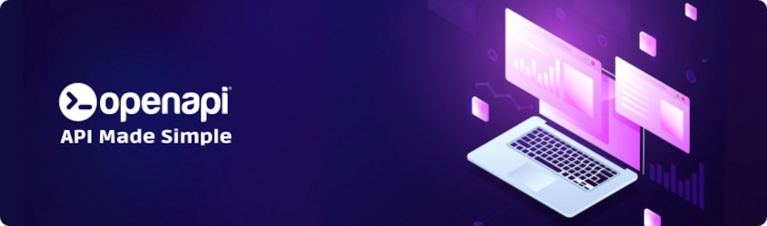

<p align="center">
  <a href="https://github.com/orgs/openapi/discussions">
    <picture>
      <source media="(prefers-color-scheme: dark)"
              srcset="https://raw.githubusercontent.com/openapi/pulse/main/public/ticker-dark.svg">
      <source media="(prefers-color-scheme: light)"
              srcset="https://raw.githubusercontent.com/openapi/pulse/main/public/ticker.svg">
      
    </picture>
  </a>
</p>

---

<div align="center">
  <a href="https://openapi.com/">
    
  </a>

  <h1>📚 Openapi® LLM Wiki</h1>
  <h4>An LLM-optimized knowledge base to ground any AI agent on the <a href="https://openapi.com/">Openapi®</a> API marketplace</h4>

[](https://github.com/openapi/openapi-llm-wiki/actions/workflows/wiki.yml)
[](LICENSE)
[](knowledge/services/)
[](knowledge/oas/)
[](https://deepwiki.com/openapi/openapi-llm-wiki)
<br>
[](https://www.linuxfoundation.org/about/members)
</div>

---

A structured, LLM-optimized knowledge base for the [Openapi](https://openapi.com) API marketplace.
Drop the contents of [`knowledge/`](knowledge/) into any LLM context to ground it with authoritative,
up-to-date information about Openapi's company profile, platform architecture, API catalog, service
endpoints, and frequently asked questions.

## How to use

### As LLM context (recommended)

This repository is designed to be consumed directly by an LLM agent or tool. Choose one of the
following approaches, depending on your workflow:

1. **Chat-based LLMs (Claude, ChatGPT, Gemini, etc.)**
   Copy and paste the entire contents of the `knowledge/` folder into a new chat or project. This
   gives the model a comprehensive understanding of every Openapi service, endpoint, authentication
   model, billing mechanism, and platform convention.

2. **Agent frameworks (OpenAI Assistants, LangChain, LlamaIndex, etc.)**
   Point your agent's vector store or file search tool at this repository. The markdown files in
   `knowledge/` are already structured for retrieval: each service has a compact endpoint table and
   each OAS spec is available as raw JSON for tool-based API generation.

3. **MCP server / custom tool**
   Clone this repo and expose it through an MCP resource or a custom file-read tool so the LLM can
   selectively load the files it needs at runtime.

4. **Openai-compatible providers with file upload**
   Upload the entire `knowledge/` tree as a project or knowledge base attachment.

5. **llms.txt**
   [`llms.txt`](llms.txt) indexes every file following the [llms.txt](https://llmstxt.org)
   convention, and [`llms-full.txt`](llms-full.txt) packs the whole knowledge base into a single
   file, ready to paste or fetch:
   `https://raw.githubusercontent.com/openapi/openapi-llm-wiki/main/llms-full.txt`

### As an MCP server (GitMCP)

[GitMCP](https://gitmcp.io) serves this repository as a remote MCP server, so any MCP client can
search and fetch the wiki on demand (it reads [`llms.txt`](llms.txt) first):

```
https://gitmcp.io/openapi/openapi-llm-wiki
```

Claude Code:

```bash
claude mcp add --transport http openapi-llm-wiki https://gitmcp.io/openapi/openapi-llm-wiki
```

Cursor, Windsurf, VS Code and other clients (`mcp.json`):

```json
{
  "mcpServers": {
    "openapi-llm-wiki": {
      "url": "https://gitmcp.io/openapi/openapi-llm-wiki"
    }
  }
}
```

You can also ask questions about the wiki in plain language on
[DeepWiki](https://deepwiki.com/openapi/openapi-llm-wiki).

### Lightweight browsing

You can also browse the files manually to look up specific services, endpoints, or platform
information without an LLM. Start with [`knowledge/README.md`](knowledge/README.md) which acts as
an index.

### Service lookup pattern

When the LLM needs information about one specific service, load only the relevant files:

```
knowledge/oas/<service>.openapi.json       →  the raw OpenAPI 3 specification
knowledge/services/<service>.md            →  human-readable endpoint summary
```

Always pair with [`knowledge/platform-guide.md`](knowledge/platform-guide.md) for cross-cutting
concerns (auth, billing, async patterns) and [`knowledge/faq.md`](knowledge/faq.md) for
troubleshooting.

## Repository structure

```
openapi-llm-wiki/
├── knowledge/
│   ├── README.md                 ← index of the knowledge base
│   ├── company-profile.md        ← who Openapi is, history, certifications, data sources
│   ├── services-catalog.md       ← catalog of all 28 APIs with base URLs and categories
│   ├── platform-guide.md         ← authentication, scopes, billing, sandbox, async patterns
│   ├── faq.md                    ← console FAQ (account, API usage, payments)
│   ├── references.md             ← official websites, GitHub repos, SDKs, Postman, status page
│   ├── services/                 ← per-service endpoint references (generated from OAS specs)
│   │   ├── company.md
│   │   ├── risk.md
│   │   ├── smsv2.md
│   │   └── ... (29 service files)
│   └── oas/                      ← snapshot of official OpenAPI 3 specifications
│       ├── 00-list.txt           ← canonical URLs for all specs
│       ├── company.openapi.json
│       ├── risk.openapi.json
│       └── ... (29 OAS files)
├── huggingface/
│   └── README.md                 ← Hugging Face dataset card
├── scripts/
│   ├── build-llms.sh             ← regenerates llms.txt and llms-full.txt
│   └── build-hf-dataset.py       ← builds the Hugging Face dataset folder
├── llms.txt                      ← llms.txt index of the knowledge base
├── llms-full.txt                 ← the whole knowledge base in one file
├── CITATION.cff
├── LICENSE
└── README.md                     ← this file
```

## What the LLM can answer

With this knowledge base loaded, the LLM can accurately answer questions such as:

- *"How do I authenticate to the Openapi platform?"*
- *"What is the base URL for the Company API and what endpoints does it expose?"*
- *"Which service should I use for Italian digital signatures?"*
- *"How does the async request pattern work for document retrieval?"*
- *"What are the differences between wallet-based and subscription billing?"*
- *"How do I create a token via the OAuth v2 API?"*
- *"Is the old OAuth v1 still supported?"*
- *"What data sources does Openapi rely on for company information?"*
- *"Generate me the curl command for looking up a German company."*

## Keeping it up to date

The canonical source of truth for OpenAPI specifications is:

```
https://console.openapi.com/oas/en/<service>.openapi.json
```

The full list of spec URLs is in [`knowledge/oas/00-list.txt`](knowledge/oas/00-list.txt).

To refresh this knowledge base:

1. Re-download each spec from its canonical URL into `knowledge/oas/`. The
   [Refresh OpenAPI specs](.github/workflows/refresh-specs.yml) workflow does this every Monday
   and opens a pull request when something changed.
2. Regenerate the endpoint summaries in `knowledge/services/` from the updated specs.
3. Run `./scripts/build-llms.sh` to regenerate `llms.txt` and `llms-full.txt` (CI fails if they
   are stale).
4. Review [`knowledge/services-catalog.md`](knowledge/services-catalog.md) and
   [`knowledge/platform-guide.md`](knowledge/platform-guide.md) for any platform-level changes.

The [API Library](https://console.openapi.com/apis) in the Openapi console is the authoritative
source for which APIs are active, deprecated, or newly introduced.

## Contributing

Contributions are always welcome! Whether you want to report bugs, suggest new features, improve documentation, or contribute code, your help is appreciated.

## Authors

- Francesco Bianco ([@francescobianco](https://www.github.com/francescobianco))
- Openapi Team ([@openapi-it](https://github.com/openapi-it))

## Partners

Meet our partners using Openapi or contributing to this project:

- [Blank](https://www.blank.app/)
- [Credit Safe](https://www.creditsafe.com/)
- [Deliveroo](https://deliveroo.it/)
- [Gruppo MOL](https://molgroupitaly.it/it/)
- [Jakala](https://www.jakala.com/)
- [Octotelematics](https://www.octotelematics.com/)
- [OTOQI](https://otoqi.com/)
- [PWC](https://www.pwc.com/)
- [QOMODO S.R.L.](https://www.qomodo.me/)
- [SOUNDREEF S.P.A.](https://www.soundreef.com/)

## Our Commitments

We believe in open source and we act on that belief. We became Silver Members
of the Linux Foundation because we wanted to formally support the ecosystem
we build on every day. Open standards, open collaboration, and open governance
are part of how we work and how we think about software.

## License

This project is licensed under the [MIT License](LICENSE).

The MIT License is a permissive open-source license that allows you to freely use, copy, modify, merge, publish, distribute, sublicense, and/or sell copies of the software, provided that the original copyright notice and this permission notice are included in all copies or substantial portions of the software.

For more details, see the full license text at the [MIT License page](https://choosealicense.com/licenses/mit/).
